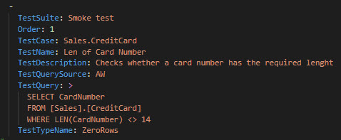
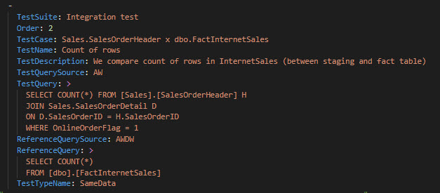
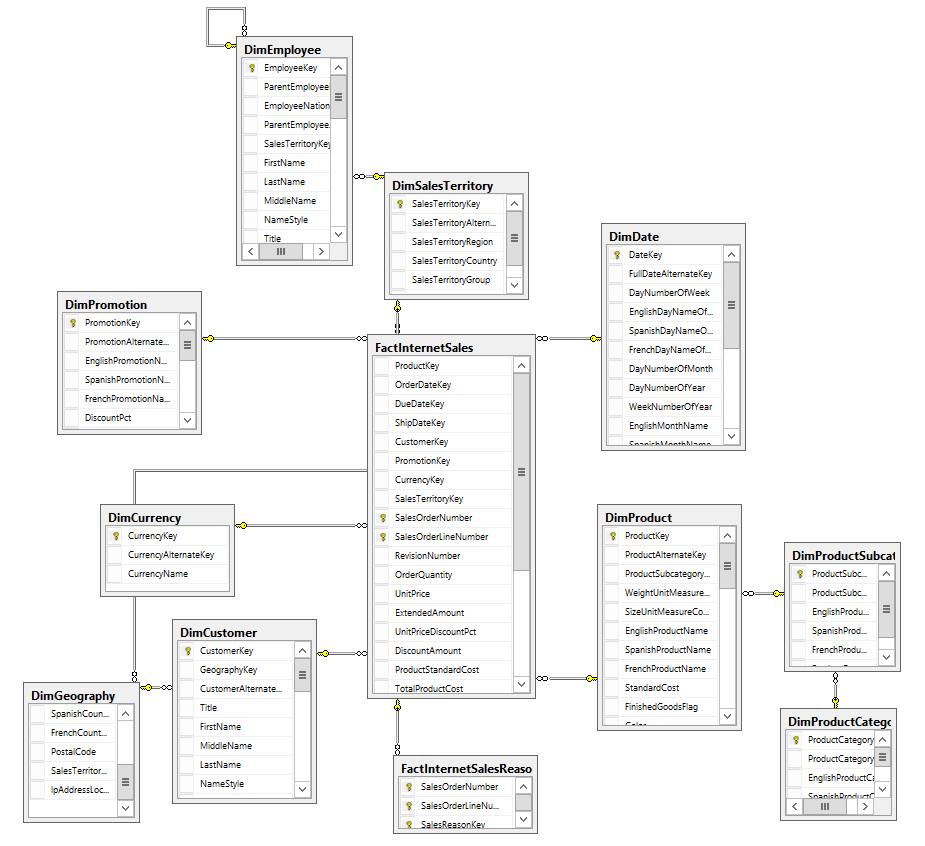

# Adventure Works Cycles - Sales

We are working with **AdventureWorks2019** and **AdventureWorksDW2019** databases, which collect data on the fictional multinational manufacturer of bicycles and accessories Adventure Works Cycles. The company was founded in 2010.

The data needs to be tested because important business decisions are based on it. Key stakeholders and sales department managers have drafted basic requirements for QA that the data must meet.

Section A outlines the requirements for smoke tests, Section B outlines the requirements for integration tests for tables in the AdventureWorks2019 database and Dim tables in the AdventureWorksDW2019 database, and finally, Section C outlines the requirements for tables in the AdventureWorks2019 database and Fact tables in the AdventureWorksDW2019 database.

Some queries are pre-filled in the assignment, so all that is required is to create tests in the TestDefinition.yaml file and copy them. If you want to try writing the queries yourself, you can use the assignment or come up with your own tests according to your imagination. :)

## Structure of the Smoke test in the TestDefinitions.yaml file:

**TestSuite:** Name of a set of several test cases, can be anything, for example, we can include all Smoke tests under TestSuite.  
**Order:** Order of the test.  
**TestCase:** Name of a set of several tests, can be anything, for example, the name of the table for which we will create several separate tests.  
**TestName:** Name of the test, can be anything, but we should be able to understand what the test is about from its name. JC.Unit combines the entire test name from TestSuite, Order, TestCase, and TestName, so it will look like this, for example, *[Smoke Sales].[1].[Sales.CreditCard].[Len of Card Number]*.  
**TestDescription:** Brief description of the test - everyone should understand what the test is about if they examine a bug.  
**TestQuerySource:** Name (alias) of the database or other source in which the query will be executed. This is the ConnectionName we defined.  
**TestQuery:** The actual query into the database or other source.  
**TestTypeName:** For Smoke tests in this case, we use **ZeroRows**. For ZeroRows, JC.Unit expects that no values will be returned to us after executing the query. If any values are returned, the test will fail.

## Structure of the Integration test in the TestDefinitions.yaml file:

**TestSuite:** Name of a set of several test cases, can be anything, for example, we can include all Integration tests under TestSuite.  
**Order:** The order of the test.  
**TestCase:** Name of a set of several tests, can be anything, for example, names of tables for which we will create multiple separate tests.  
**TestName:** Name for the test, can be anything, but we should be able to understand what the test is about from it. From TestSuite, Order, TestCase, and TestName, JC.Unit makes up the entire name of the test, so it will look like this, for example, *[Integration Sales].[1].[Sales.SalesTerritory x dbo.DimSalesTerritory].[Values of SalesTerritoryRegion]*.  
**TestDescription:** A brief description of the test - everyone should then understand what the test is about if they are investigating a bug.  
**TestQuerySource:** Name (alias) of the database or other source where the first query will be executed. This is the ConnectionName that we defined.  
**TestQuery:** The actual query into the database or other source.  
**ReferenceQuerySource:** Name (alias) of the database or other source where the second reference query will be executed. This is the ConnectionName that we defined.  
**ReferenceQuery:** The actual query into the database or other source.  
**TestTypeName:** For Integration tests in this case, we use **SameData**. With SameData, JC.Unit expects the same values to be returned from both queries. If the values are not the same, the test will fail. The order of the values matters, which is why we use Order by.

At the end of the document, you can find information about tables in AdventureWorks2019.

## A)  Smoke tests

| Test requirement | Nam of the table in AdventureWorks2019 database | Query |
|-|-|-|
|Values in the CardNumber column must have 14 characters.| [Sales].[CreditCard] |SELECT CardNumber   FROM [Sales].[CreditCard]   WHERE LEN(CardNumber) <> 14|
|The AccountNumber column must be filled (cannot be NULL).| [Sales].[Customer] | SELECT *   FROM Sales.Customer   WHERE AccountNumber IS NULL |
|No value in the LineTotal column can be 0 or NULL. | [Sales].[SalesOrderDetail] | |
|The total bonus amount (sum of the Bonus column) must not exceed 50,000.| [Sales].[SalesPerson] | |
|The SalesPersonQuotaHistory table must not be empty.| [Sales].[SalesPersonQuotaHistory] | SELECT COUNT(\*)   FROM Sales.SalesPersonQuotaHistory   HAVING COUNT(\*) = 0 |
|Individual values of 'Canadian GST' in the Name column must not have a TaxRate value less than 7.| [Sales].[SalesTaxRate] | |
|Individual values of 'Reseller' in the Category column must not have a DiscountPct value greater than 0.4.| [Sales].[SpecialOffer] | |
|If the OnlineOrderFlag in the SalesOrderHeader table has a value of 0, the shipping method (Name in the Purchasing.ShipMethod table) must have a value of 'CARGO TRANSPORT 5' only. | [Sales].[SalesOrderHeader], join [Purchasing].[ShipMethod] | SELECT SOH.OnlineOrderFlag, SOH.ShipMethodID, SM.Name   FROM [Sales].[SalesOrderHeader] SOH   JOIN Purchasing.ShipMethod SM ON SM.ShipMethodID = SOH.ShipMethodID   WHERE SOH.OnlineOrderFlag = 0 AND SM.Name NOT IN ('CARGO TRANSPORT 5')|
|Values in the OrderDate column must not contain a date older than 2010 (that means not 2009, 2008 etc).| [Sales].[SalesOrderHeader] | |

## B)  Integration tests for Dim tables

| Test requirement | Table in AdventureWorks2019 | Table in AdventureWorksDW2019 | Query AdventureWorks2019 | Query AdventureWorksDW2019 |
|-|-|-|-|-|
|The values in the Name column of the SalesTerritory table must be the same as the values in the SalesTerritoryRegion column of the DimSalesTerritory table.| [Sales].[SalesTerritory] | [dbo].[DimSalesTerritory] | | |
|The values in the Name and ReasonType columns of the SalesReason table must be the same as the values in the SalesReasonName and SalesReasonReasonType columns of the DimSalesReason table, using the HASH function. | [Sales].[SalesReason] | [dbo].[DimSalesReason] | SELECT HASHBYTES('SHA1', Name + ReasonType)   FROM Sales.SalesReason   ORDER BY Name | SELECT HASHBYTES('SHA1', SalesReasonName + SalesReasonReasonType)   FROM [dbo].[DimSalesReason]   ORDER BY SalesReasonName |

## C)  Integration tests for Fact tabules

| Test requirement  | Table in AdventureWorks2019 | Table in AdventureWorksDW2019 | Query AdventureWorks2019 | Query AdventureWorksDW2019 | Note |
|-|-|-|-|-|-|
|The sum of LineTotal for internet orders in the SalesOrderDetail table must be equal to the sum of SalesAmount in the FactInternetSales table.| [Sales].[SalesOrderHeader], join [Sales].[SalesOrderDetail] | [dbo].[FactInternetSales] | SELECT SUM(D.LineTotal)   FROM [Sales].[SalesOrderHeader] H   JOIN Sales.SalesOrderDetail D ON D.SalesOrderID = H.SalesOrderID   WHERE H.OnlineOrderFlag = 1; | SELECT SUM(SalesAmount) AS TotalOnlineSales   FROM [dbo].[FactInternetSales]; | Join the SalesOrderDetail table with the SalesOrderHeader table where internet orders are indicated by a value of 1 in the OnlineOrderFlag column. |
|The number of rows for internet orders in the SalesOrderDetail table must be equal to the number of rows in the FactInternetSales table. | [Sales].[SalesOrderHeader], join [Sales].[SalesOrderDetail] | [dbo].[FactInternetSales] | | | Join the SalesOrderDetail table with the SalesOrderHeader table where internet orders are indicated by a value of 1 in the OnlineOrderFlag column. |
|The sum of the LineTotal column for individual areas (internet orders) must be equal to the sum of SalesAmount in the FactInternetSales table for individual areas. | [Sales].[SalesOrderHeader], join [Sales].[SalesOrderDetail], join [Sales].[SalesTerritory] | [dbo].[FactInternetSales], join [dbo].[DimSalesTerritory] | SELECT T.Name, SUM(D.LineTotal) AS SumLineTotal   FROM [Sales].[SalesOrderHeader] H JOIN Sales.SalesOrderDetail D ON D.SalesOrderID = H.SalesOrderID   JOIN Sales.SalesTerritory T ON T.TerritoryID = H.TerritoryID   WHERE H.OnlineOrderFlag = 1   GROUP BY T.Name ORDER BY T.Name; | SELECT T.SalesTerritoryRegion, SUM(S.SalesAmount) AS SumSalesAmount   FROM [dbo].[FactInternetSales] S   JOIN dbo.DimSalesTerritory T ON T.SalesTerritoryKey = S.SalesTerritoryKey   GROUP BY T.SalesTerritoryRegion   ORDER BY T.SalesTerritoryRegion; | Join the SalesOrderDetail table with the SalesOrderHeader table where internet orders are indicated by a value of 1 in the OnlineOrderFlag column. Regions can be found in the Name column of the Sales.SalesTerritory table and the SalesTerritoryRegion column of the dbo.DimSalesTerritory table. | 
|The sum of the LineTotal column for individual products (internet orders) must be equal to the sum of SalesAmount in the FactInternetSales table for individual products. | [Sales].[SalesOrderHeader], join [Sales].[SalesOrderDetail], join [Production].[Product] | [dbo].[FactInternetSales], join [dbo].[DimProduct] | | | Join the SalesOrderDetail table with the SalesOrderHeader table where internet orders are indicated by a value of 1 in the OnlineOrderFlag column. Products can be found in the Name column of the Production.Product table and the EnglishProductName column of the dbo.DimProduct table.|

## Overview of tables in the Sales department in the AdventureWorks2019 database.
|Table Name|Description|
|-|-|
  |Sales.CountryRegionCurrency         |Cross-reference table mapping ISO currency codes to a country or region.|
  |Sales.CreditCard                    |Customer credit card information.|
  |Sales.Currency                      |Lookup table containing standard ISO currencies.|
  |Sales.CurrencyRate                  |Currency exchange rates.|
  |Sales.Customer                      |Current customer information. Also see the Person and Store tables.|
  |Sales.PersonCreditCard              |Cross-reference table mapping people to their credit card information in the CreditCard table|
  |Sales.SalesOrderDetail              |Individual products associated with a specific sales order. See SalesOrderHeader.|
  |Sales.SalesOrderHeader              |General sales order information.|
  |Sales.SalesOrderHeaderSalesReason   |Cross-reference table mapping sales orders to sales reason codes.|
  |Sales.SalesPerson                   |Sales representative current information.|
  |Sales.SalesPersonQuotaHistory       |Sales performance tracking.|
  |Sales.SalesReason                   |Lookup table of customer purchase reasons.|
  |Sales.SalesTaxRate                  |Tax rate lookup table.|
  |Sales.SalesTerritory                |Sales territory lookup table.|
  |Sales.SalesTerritoryHistory         |Sales representative transfers to other sales territories.|
  |Sales.ShoppingCartItem              |Contains online customer orders until the order is submitted or cancelled.|
  |Sales.SpecialOffer                  |Sale discounts lookup table.|
  |Sales.SpecialOfferProduct           |Cross-reference table mapping products to special offer discounts.|
  |Sales.Store                         |Customers (resellers) of Adventure Works products.|

## Table schema in the AdventureWorks2019 database

## Table schema in the AdventureWorksDW2019 database
