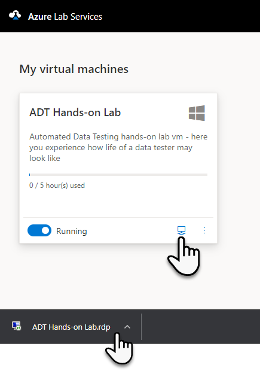

# Lab Registration

Link to sign in to Azure Lab Services:

[Azure Lab Services](https://labs.azure.com/register/t5vxjqi8)

## 1.  Sign in with your Microsoft account (personal or organizational)

## 2.  Wait for the registration process to complete

 

## 3.  If you provided an incorrect email during registration, you will see the following: 

We will resolve this issue by asking you to let us know (preferably in the chat) the correct email associated with your Microsoft account (whether it's personal or organizational).

## 4.  Otherwise, you will see the available labs

-   Click on our lab - a .rdp file will be downloaded

-   Click on this file as well

-   Confirm the next login dialogs

## 5.  Enter your login information

-   Choose \"more choices\"

-   Then \"Use a different account\"

-   Enter the name and password

    -   Name: **tester**

    -   Password: **Superstar68**

 
## 6. If everything goes well, you will arrive at our destination!

 

